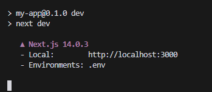

# Assistants API

<p align="center">
  
</p>

## サンプルプロジェクト
### Next.js
https://github.com/admineral/Openai-Assistant-API-UI.git

### Python
TODO:

## 基本概念
### GPTsとは何が違うの？
- ホストの柔軟性: Assistant APIを使用すると、ユーザーは自分のサーバー上でアシスタントをホストできます。これにより、データのプライバシーとセキュリティを確保することができます。
- カスタマイズ可能: GPTsとは異なり、Assistant APIを使用すると、ユーザーは自分のニーズに合わせてアシスタントの挙動をカスタマイズできます。
- 独自のトレーニングデータ: GPTsは一般的なデータセットでトレーニングされますが、Assistant APIを使用すると、独自のデータセットを使用してアシスタントをトレーニングし、特定のドメインや業界に特化した応答を生成できます。
- リアルタイムの最適化: GPTsは一度トレーニングされるとその挙動を変更することはできませんが、Assistant APIを使用すると、ユーザーのフィードバックに基づいてアシスタントのパフォーマンスをリアルタイムで最適化できます。

## サンプルをやってみよう
※OpenAIのAPI-KEY取得は割愛
### Next.js
```bash
git clone https://github.com/admineral/Openai-Assistant-API-UI.git

```
クローンしたディレクトリに移動し
必要なパッケージをインストール

```bash
cd Openai-Assistant-API-UI
npm install
```
.envファイルを作成し以下の定義を入れる
```env
OPENAI_API_KEY=＜your-openai-apikey＞
```
*利用料がかかるので使い過ぎに注意。


開発サーバーを起動
```bash
npm run dev
```

ブラウザで上記のURLを開きます。


`app/page.tsx`を編集すると、ページが自動的に更新されます。

## Function Calling
https://platform.openai.com/docs/guides/function-calling

